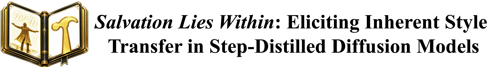
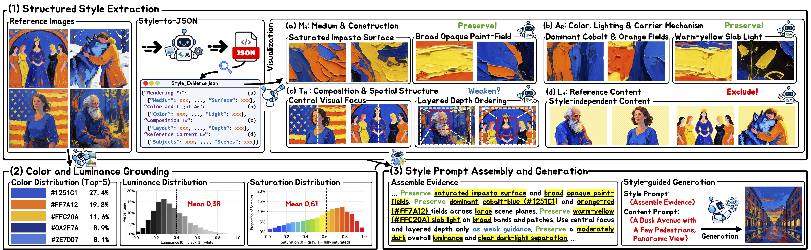

 

This is the Pytorch implementation for our paper: [**Salvation Lies Within: Eliciting Inherent Style Transfer in Step-Distilled Diffusion Models**](https://arxiv.org/abs/2610.05066). 

## Abstract

  Adapting step-distilled text-to-image (T2I) models through post-training incurs additional computational costs and affects native few-step generation behavior. This motivates a complementary route beyond style-specific adaptation: drawing on the visual knowledge already encoded in step-distilled T2I models to elicit stylistic capabilities through language. Pursuing this direction requires textual guidance that captures how visual attributes jointly define a style and remain applicable as the depicted content changes. To explore this approach, we introduce StyleForge, a fully automatic, training-free framework that expresses reference styles as reusable rendering instructions. By integrating overall rendering characteristics with local color and lighting behavior, StyleForge organizes visual evidence from reference images into a coherent specification of how the target style should be expressed. The specification is then compiled into textual guidance that can be reused across content prompts, enabling frozen step-distilled T2I models to render different subjects and scenes in the reference style while retaining native few-step generation. Extensive experiments show relative gains of up to 29.47\% in generation quality scores over the strongest baseline, while Pareto analysis indicates that improved stylization is accompanied by strong adherence to the requested content.

 
 

